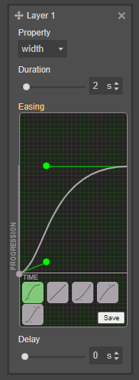

# gjs-easing-editor

This repo demonstrates how to implement a [cubic-bezier-editor](https://github.com/Ju99ernaut/cubic-bezier-editor) into grapesjs as a plugin. While this is not a plugin it can be used as reference for how the plugin might be implemented. 

 

## Usage

Clone the repo and open `index.html`

## Development

Clone the repository

```sh
$ git clone https://github.com/Ju99ernaut/gjs-easing-editor.git
$ cd grapesjs-blockly
```

## License

MIT